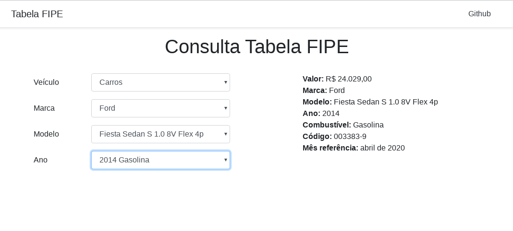

Tabela FIPE
===========

Biblioteca em PHP para pesquisar dados da tabela FIPE.

Este pacote foi desenvolvido em base desse link: https://deividfortuna.github.io/fipe/

## Demo

Criei uma aplicação de exemplo em VueJs para consumir esse pacote. Para rodar execute os seguintes comandos:

`git clone https://github.com/aristidesneto/tabela-fipe.git && cd tabela-fipe`

`composer install`

`php -S localhost:8080 -t demo/`



## Como usar

A consulta pode ser realizada por 3 tipos de veículos:

1. Carros
2. Motos
3. Caminhões

### Exemplo de como consultar dados de um carro:

```php
<?php

use Aristides\TabelaFIPE\TabelaFipe;
use Aristides\TabelaFIPE\Veiculo\Cars;

require __DIR__ . '/vendor/autoload.php';

$cars = new Cars;
$tabela = new TabelaFipe($cars);

// Lista todas as marcas
// echo $tabela->marcas();

// Lista todos os modelos de código 22 (Marca Ford)
// echo $tabela->modelos(22);

// Lista todos os anos do modelo 4135 (Modelo Fiesta)
// echo $tabela->ano(22, 4135);

// Lista todos as informações e valores do Ford Fiesta do ano de 2011
echo $tabela->preco(22, 4135, '2011-1');

// Resultado
{
     "Valor": "R$ 19.676,00",
     "Marca": "Ford",
     "Modelo": "Fiesta 1.0 8V Flex/Class 1.0 8V Flex 5p",
     "AnoModelo": 2011,
     "Combustivel": "Gasolina",
     "CodigoFipe": "003310-3",
     "MesReferencia": "março de 2020 ",
     "TipoVeiculo": 1,
     "SiglaCombustivel": "G"
}
```

### Exemplo para consultar dados de uma moto

```php
<?php

use Aristides\TabelaFIPE\TabelaFipe;
use Aristides\TabelaFIPE\Veiculo\Motorcycle;

require __DIR__ . '/vendor/autoload.php';

$motorcycle = new Motorcycle;
$tabela = new TabelaFipe($motorcycle);

// Motos
// echo $tabela->marcas();
// echo $tabela->modelos(77);
// echo $tabela->ano(77, 8161);
echo $tabela->preco(77, 8161, '2018-1');

// Response
{
    "Valor": "R$ 70.063,00",
    "Marca": "HARLEY-DAVIDSON",
    "Modelo": "ROAD KING SPECIAL FLHRXS",
    "AnoModelo": 2018,
    "Combustivel": "Gasolina",
    "CodigoFipe": "810085-3",
    "MesReferencia": "março de 2020 ",
    "TipoVeiculo": 2,
    "SiglaCombustivel": "G"
}
```

### Exemplo para consultar dados de um caminhão

```php
<?php

use Aristides\TabelaFIPE\TabelaFipe;
use Aristides\TabelaFIPE\Veiculo\Trucks;

require __DIR__ . '/vendor/autoload.php';

$truck = new Trucks;
$tabela = new TabelaFipe($truck);

// Caminhões
// echo $tabela->marcas();
// echo $tabela->modelos(109);
// echo $tabela->ano(109, 4052);
echo $tabela->preco(109, 4052, '2012-3');

// Response
{
    "Valor": "R$ 244.856,00",
    "Marca": "MERCEDES-BENZ",
    "Modelo": "Axor 4144 K 6x4 2p (diesel)",
    "AnoModelo": 2012,
    "Combustivel": "Diesel",
    "CodigoFipe": "509255-8",
    "MesReferencia": "março de 2020 ",
    "TipoVeiculo": 3,
    "SiglaCombustivel": "D"
}
```

## Métodos disponíveis

`marcas()` Retorna todas as marcas

`modelos(int $codMarca)` Retorna todos os modelos

`ano(int $codMarca, int $codModelo)` Retorna todos os anos

`preco(int $codMarca, int $codModelo, string $ano)` Retorna os dados do veículo

## Testes

Para executar os testes:

`composer run test`
